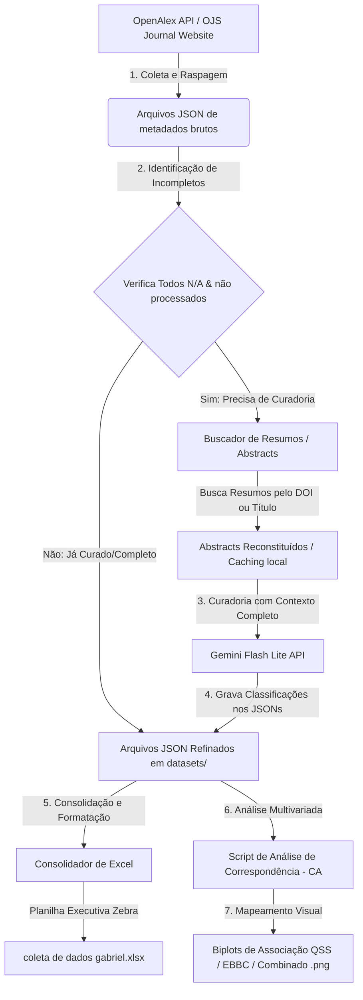
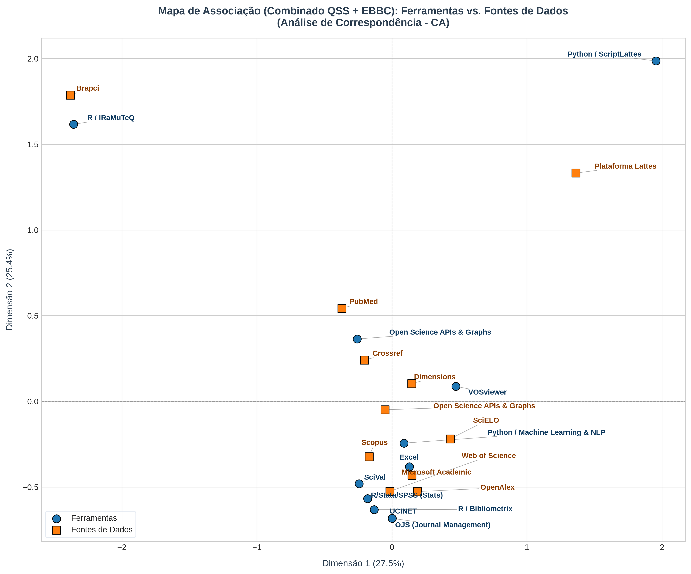
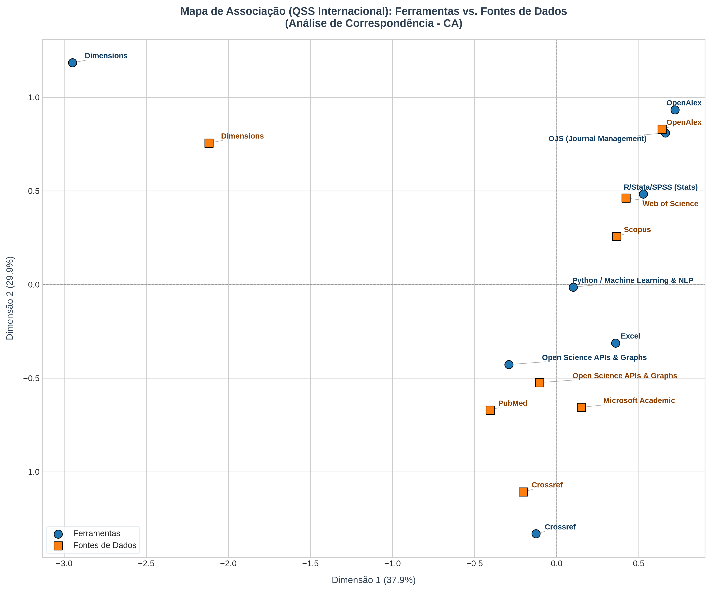

# Extrator de Metadados, Classificação Semântica e Curadoria por IA

[](https://doi.org/10.5281/zenodo.20638523)
[](LICENSE)
[](README_EN.md)
[](https://github.com/gabrielbaiano/-academic-research/releases)

Este diretório contém o pipeline automatizado e inteligente para extração, análise de texto, curadoria semântica e consolidação em planilhas de **todas as publicações científicas** da prestigiada revista **Quantitative Science Studies (QSS)** (Volumes 1 a 6) e do **Encontro Brasileiro de Bibliometria e Cientometria (EBBC)** (anos 2020, 2022 e 2024).

O objetivo deste pipeline é classificar quais ferramentas de software/estatísticas foram aplicadas nos artigos, onde foram aplicadas (coleta, análise ou visualização) e de quais fontes os dados da pesquisa foram extraídos.

---

## 📊 Fluxo de Funcionamento do Pipeline

O diagrama abaixo ilustra o fluxo lógico de execução do projeto, desde a coleta inicial de metadados até a geração da planilha Excel consolidada:



---

## ⚡ Curadoria por IA e Segurança Operacional

Para garantir uma classificação de alta precisão científica sem comprometer a estabilidade do sistema ou gerar desperdício de recursos, o pipeline foi desenhado com técnicas avançadas de engenharia de software e segurança operacional:

### 1. Curadoria Semântica com Gemini API (`gemini-flash-lite-latest`)
O modelo da Google é alimentado com o resumo (*abstract*) do artigo. Ele analisa o contexto acadêmico e identifica:
* **Uso Real de Ferramentas:** Diferencia se um autor apenas *citou* um software ou se ele *realmente o utilizou* para obter os resultados.
* **Contexto de Aplicação:** Mapeia se a ferramenta foi usada na coleta de dados, na análise estatística ou na visualização (gráficos/redes).
* **Fontes de Dados:** Identifica de onde os dados empíricos foram extraídos (ex: Scopus, Lattes, Crossref, bases de patentes).

### 2. Técnicas de Segurança e Resiliência Operacional
* **Saída Estruturada via JSON Schema (Segurança de Parse):** Forçamos a API do Gemini a responder **estritamente em formato JSON estruturado** com chaves predefinidas. Isso elimina qualquer risco de o modelo "alucinar" textos livres ou responder em formatos inválidos, tornando a inserção de metadados 100% segura para os scripts de consolidação.
* **Persistência Intermediária em Lotes (Batch Saving):** A cada lote de 10 artigos analisados pela IA, os dados são salvos em disco sobrescrevendo os arquivos JSON originais. Em caso de interrupção inesperada (queda de rede, estouro de cota ou interrupção do console), nenhum progresso ou token é desperdiçado: o pipeline continua exatamente do último ponto salvo.
* **Cache Local de Resumos (Fair Use e Polidez):** A extração de resumos de portais universitários (como o OJS do EBBC) é cacheada localmente na pasta `datasets/cache/`. Isso evita sobrecarga de requisições repetidas nos servidores das universidades (respeitando as regras de *web scraping* ético) e acelera execuções subsequentes a tempo zero.
* **Filtros Híbridos de Pré-Processamento:** Antes de acionar a API do Gemini, o script executa uma análise local via expressões regulares (regex) aprimoradas para detectar usos explícitos e óbvios de linguagens de programação (como R e Python). Isso economiza custos de processamento ao evitar chamadas de API desnecessárias para casos triviais.
* **Paginação Inteligente (OpenAlex):** O pipeline lida com grandes volumes de artigos (QSS) implementando paginação inteligente na API do OpenAlex, garantindo que nenhum metadado de artigo seja omitido ou truncado por limites de requisição.

---

## 📈 Análise de Correspondência (Correspondence Analysis - CA)

Para compreender as associações metodológicas e mapear a estrutura intelectual da área, o pipeline inclui um script de **Análise de Correspondência (CA)**. Esse script correlaciona estatisticamente as **Ferramentas Utilizadas** com as **Fontes de Coleta de Dados** nos datasets do QSS e do EBBC.

### Como Executar a Análise
Para executar a análise de correspondência e regenerar os biplots, rode:
```bash
python scripts/correspondence_analysis.py
```

### Resultados Obtidos (Biplots)
A análise filtra automaticamente tautologias de nicho isolado (como Altmetric) e ruídos de baixa frequência ($N < 2$) para evitar distorções de escala, garantindo uma inércia explicada acumulada de **67,85%** no QSS:

1. **Mapa Combinado (QSS + EBBC)**: Revela três trajetórias metodológicas principais na cientometria:
   * **Ecossistema Python Nacional**: ScriptLattes fortemente associado à Plataforma Lattes.
   * **Ecossistema R Nacional**: IRaMuTeQ intimamente ligado a bases nacionais/locais (Brapci, CNPq).
   * **Núcleo Cientométrico Global**: Onde ferramentas visuais (VOSviewer, Bibliometrix) e ecossistemas de desenvolvimento (Python/ML, R/Stats) orbitam em torno das grandes bases de dados globais.

   

2. **Mapa Nacional (EBBC)**: Evidencia a forte preferência pela aplicação de softwares de prateleira (VOSviewer, Pajek, SciVal, Bibliometrix) aplicados a contextos de infraestrutura e dados brasileiros (Lattes, Brapci, Sucupira).

   

3. **Mapa Internacional (QSS)**: Mostra um ecossistema dominado por ecossistemas programáveis e algoritmos. O **Python/ML** atua como hub central conectando modelos de processamento de linguagem natural (Transformers/LLMs) a repositórios de preprints, enquanto o ecossistema do **Dimensions**, **OpenAlex** e **Crossref** se estruturam de forma vertical e integrada às suas respectivas APIs.

   

---

## 📂 Estrutura do Projeto

Os arquivos foram organizados de forma modular e limpa:

```text
├── coleta de dados gabriel.xlsx      # Planilha final consolidada com todas as abas estilizadas
├── analise_ia_cienciometria.xlsx     # Nova planilha de análise de IA consolidada
├── executar_curadoria.py             # Script atalho de execução na raiz
├── README.md                         # Documentação do projeto (Português)
├── README_EN.md                      # Documentação do projeto (Inglês)
├── documentos/                       # Pasta contendo os relatórios e textos de fundamentação
│   ├── METODOLOGIA.md                # Descrição metodológica geral da pesquisa
│   ├── RESULTADOS_DISCUSSAO.md       # Resultados e discussões detalhadas
│   └── relatorio_comparativo_ia.md   # Relatório comparativo sobre a tese de IA (QSS vs. EBBC)
├── graficos/                         # Pasta contendo os biplots e figuras estatísticas
│   ├── ca_biplot_combined.png
│   ├── ca_biplot_ebbc.png
│   ├── ca_biplot_qss.png
│   └── ...                           # Outras figuras de resultados do projeto
├── datasets/                         # Pasta contendo os conjuntos de dados em JSON
│   ├── cache/                        # Caches locais de resumos (evita sobrecarga de APIs/OJS)
│   │   ├── ebbc_2020_abstracts_cache.json
│   │   ├── ebbc_2022_abstracts_cache.json
│   │   └── ebbc_2024_abstracts_cache.json
│   ├── ebbc_2020_data.json
│   ├── ebbc_2022_data.json
│   ├── ebbc_2024_data.json
│   ├── qss_volume_1_data.json
│   ├── qss_volume_2_data.json
│   ├── qss_volume_3_data.json
│   ├── qss_volume_4_data.json
│   ├── qss_volume_5_data.json
│   └── qss_volume_6_data.json
└── scripts/                          # Pasta contendo os códigos-fontes do pipeline
    ├── refine_with_abstracts.py      # Script principal do menu interativo e integração IA
    ├── analyze_ai_integration.py     # Script da pipeline de análise e comparação de IA
    ├── generate_styled_xlsx_all.py   # Gerador da planilha final (todas as abas)
    ├── generate_styled_xlsx.py       # Gerador da planilha (Volumes 5 e 6 do QSS)
    ├── refine_dataset.py             # Curadoria manual específica do Volume 6
    └── ...                           # Outros scripts de extração e suporte
```

---

## 🛠️ Como Funciona e Como Executar (Tutorial)

### Pré-requisitos
- Python 3.10 ou superior.
- Instale as dependências executando:
  ```bash
  pip install -r requirements.txt
  ```

### Executando a Curadoria
Para rodar a curadoria inteligente dos dados e atualizar a planilha Excel, basta executar o atalho criado na raiz do projeto:

```bash
python executar_curadoria.py
```

Isso abrirá um menu de console interativo com estatísticas em tempo real:

```text
============================================================
      SISTEMA DE CURADORIA DE PESQUISAS ACADÊMICAS (IA)
============================================================
Opção  | Dataset              | Total  | Todos N/A (Incompletos)
------------------------------------------------------------
 1     | QSS Vol 1 (2020)     | 91     | 0                     
 2     | QSS Vol 2 (2021)     | 74     | 0                     
 3     | QSS Vol 3 (2022)     | 58     | 0                     
 4     | QSS Vol 4 (2023)     | 52     | 0                     
 5     | EBBC 2020            | 90     | 0                     
...
------------------------------------------------------------
 10    | REFINE TODOS os datasets acima consecutivamente
 11    | RECONSTRUIR Planilha Excel (coleta de dados gabriel.xlsx)
 12    | EXECUTAR ANÁLISE COMPARATIVA DE IA (QSS vs. EBBC)
 13    | SAIR
============================================================
Selecione uma opção (1-13):
```

### Explicação das Opções:
- **Opções de 1 a 9**: Rodam a curadoria de IA em um volume/ano específico.
- **Opção 10**: Executa a curadoria em todos os conjuntos de dados que ainda possuem registros não refinados (`Incompletos`).
- **Opção 11**: Apenas lê os dados do diretório `datasets/` e reconstrói a planilha Excel consolidada `coleta de dados gabriel.xlsx` na raiz do projeto.
- **Opção 12**: Executa a nova pipeline de classificação comparativa de IA (QSS vs. EBBC), gerando a planilha `analise_ia_cienciometria.xlsx` e o relatório `documentos/relatorio_comparativo_ia.md`.
- **Opção 13**: Fecha o menu.

---

## 🔑 A Importância da Chave do Gemini (API Key)

Para realizar a classificação semântica avançada de texto dos resumos dos artigos, o pipeline utiliza o modelo de inteligência artificial de alta performance **Gemini Flash Lite (`gemini-flash-lite-latest`)** da Google. 

### Por que é necessária?
A IA é responsável por interpretar o resumo textual do artigo (que pode estar em inglês ou português), identificar se um software foi usado ativamente, classificar o local de uso e mapear de onde os dados empíricos foram extraídos. Isso substitui regras simples de busca por palavras-chave (regex), que falham frequentemente em encontrar termos não triviais.

### Como configurar a sua chave de API?
O pipeline possui uma chave pública padrão configurada para execuções iniciais livres. Caso você queira utilizar sua própria chave da Google AI Studio (recomendado para uso em larga escala ou chaves privadas dedicadas):

1. **Configuração Temporária (Terminal)**:
   - No Windows PowerShell:
     ```powershell
     $env:GEMINI_API_KEY="SUA_CHAVE_AQUI"
     python executar_curadoria.py
     ```
   - No CMD (Prompt de Comando):
     ```cmd
     set GEMINI_API_KEY=SUA_CHAVE_AQUI
     python executar_curadoria.py
     ```

2. **Edição do Código**:
   Você também pode editar diretamente o arquivo `scripts/refine_with_abstracts.py` e alterar o valor padrão da variável na linha 16.

---

## 📝 Como Citar

Se você utilizar este código ou os conjuntos de dados em sua pesquisa, por favor cite como:

**APA:**
Gama, G. N. (2026). Extrator de Metadados, Classificação Semântica e Curadoria por IA para Quantitative Science Studies (QSS) e EBBC (Versão 2.0.0). Zenodo. https://doi.org/10.5281/zenodo.20638523

**BibTeX:**
```bibtex
@software{gama_curadoria_2026,
  author       = {Gama, Gabriel Nascimento},
  title        = {Extrator de Metadados, Classificação Semântica e Curadoria por IA para Quantitative Science Studies (QSS) e EBBC},
  month        = jun,
  year         = 2026,
  publisher    = {Zenodo},
  version      = {2.0.0},
  doi          = {10.5281/zenodo.20638523},
  url          = {https://doi.org/10.5281/zenodo.20638523}
}
```

---

## 📄 Licença

Este projeto está licenciado sob a Licença MIT - consulte o arquivo [LICENSE](LICENSE) para obter mais detalhes.
