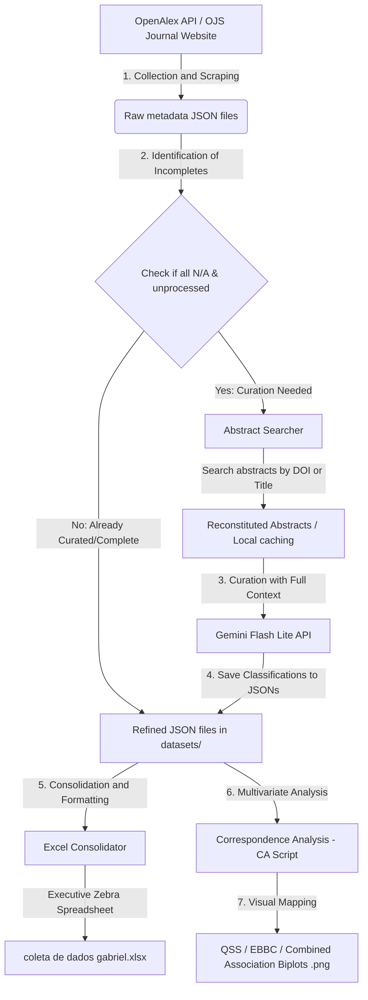
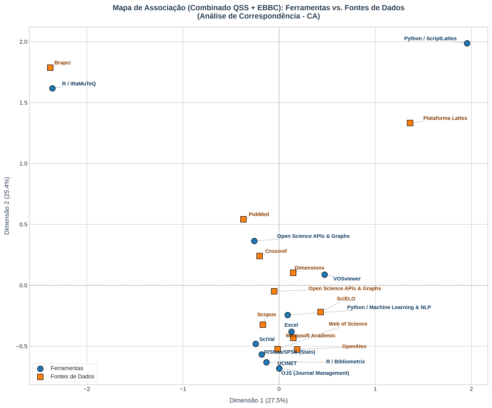
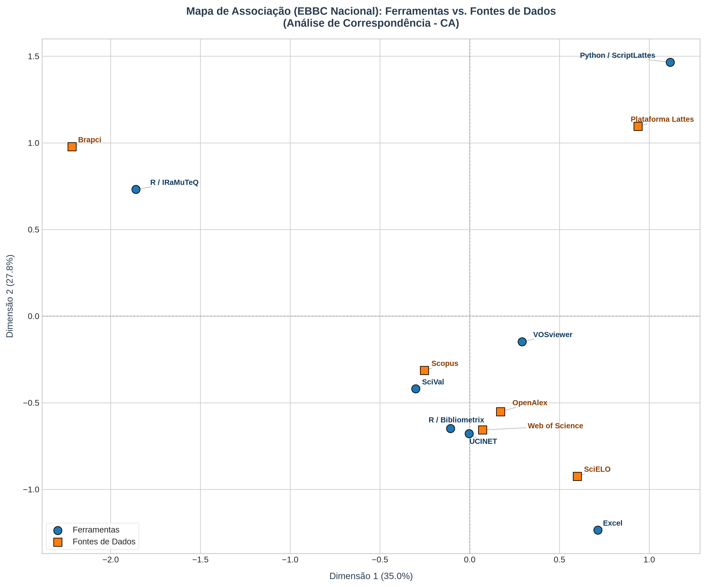
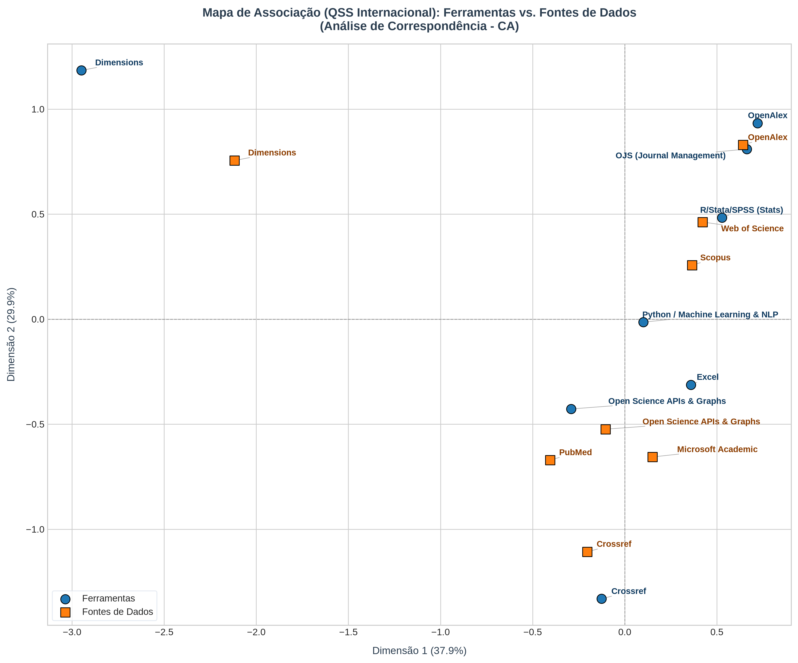

# Metadata Extractor, Semantic Classification, and AI-Driven Curation

[](https://doi.org/10.5281/zenodo.20638523)
[](LICENSE)
[](README.md)
[](https://github.com/gabrielbaiano/-academic-research/releases)

This directory contains the automated and intelligent pipeline for extraction, text analysis, semantic curation, and Excel spreadsheet consolidation of **all scientific publications** from the prestigious journal **Quantitative Science Studies (QSS)** (Volumes 1 to 6) and the **Encontro Brasileiro de Bibliometria e Cientometria (EBBC)** (years 2020, 2022, and 2024).

The goal of this pipeline is to classify which software/statistical tools were applied in the articles, where they were applied (data collection, analysis, or visualization), and from which sources the research data was extracted.

---

## 📊 Pipeline Workflow

The diagram below illustrates the logical flow of the project's execution, from the initial metadata collection to the generation of the consolidated Excel spreadsheet:



---

## ⚡ AI Curation & Operational Safety

To ensure high scientific classification accuracy without compromising system stability or wasting computing resources, the pipeline has been designed incorporating advanced software engineering and operational safety techniques:

### 1. Semantic Curation via Gemini API (`gemini-flash-lite-latest`)
The Google AI model receives the article's *abstract* and analyzes the academic context to identify:
* **Active Tool Utilization:** Differentiates whether an author merely *mentioned* a software tool or *actually used* it to obtain their results.
* **Context of Application:** Classifies whether the tool was used in data collection, statistical analysis, or visualization (graphs/networks).
* **Data Sources:** Maps from which database or repository the empirical research data was gathered (e.g., Scopus, Lattes, Crossref, Patent databases).

### 2. Security and Operational Resilience Techniques
* **Structured Output via JSON Schema (Safe Parsing):** We enforce the Gemini API to respond **strictly in a structured JSON format** using a predefined JSON Schema. This eliminates any risk of the model "hallucinating" free-form text or returning unparseable syntax, ensuring that data insertion is 100% safe for consolidation scripts.
* **Intermediate Batch Persistence (Batch Saving):** Every batch of 10 articles processed by the AI is written directly to disk, overwriting the original JSON files. In case of unexpected connection loss, rate limit issues, or console terminations, no progress or API tokens are wasted: the pipeline resumes exactly from where it left off.
* **Local Abstracts Caching (Politeness & Fair Use):** Extracting abstracts from university journal platforms (such as the EBBC OJS portal) is cached locally under `datasets/cache/`. This avoids overloading university servers (adhering to ethical web scraping guidelines) and accelerates subsequent executions.
* **Hybrid Pre-processing Filters:** Prior to calling the Gemini API, the script performs a local check using optimized regular expressions (regex) to detect clear and obvious programming language usage (such as Python and R). This saves processing time and API tokens for trivial cases.
* **Intelligent Pagination (OpenAlex):** The pipeline handles large volumes of articles (QSS) by implementing smart pagination on the OpenAlex API, ensuring no articles are skipped or truncated.

---

## 📈 Correspondence Analysis (CA)

To understand methodological associations and map the intellectual structure of the field, the pipeline includes a **Correspondence Analysis (CA)** script. This script statistically correlates **Tools Used** with **Data Collection Sources** across both QSS and EBBC datasets.

### How to Run the Analysis
To run the correspondence analysis and regenerate the biplots, run:
```bash
python scripts/correspondence_analysis.py
```

### Obtained Results (Biplots)
The analysis automatically filters out isolated niche tautologies (such as Altmetric) and low-frequency noise ($N < 2$) to avoid scale distortion, ensuring an accumulated explained inertia of **67.85%** for the QSS:

1. **Combined Map (QSS + EBBC)**: Reveals three main methodological trajectories in scientometrics:
   * **National Python Ecosystem**: ScriptLattes strongly associated with Plataforma Lattes.
   * **National R Ecosystem**: IRaMuTeQ closely linked to national/local databases (Brapci, CNPq).
   * **Global Scientometric Core**: Where visual tools (VOSviewer, Bibliometrix) and development ecosystems (Python/ML, R/Stats) orbit around major global databases.

   

2. **National Map (EBBC)**: Highlights a strong preference for ready-to-use software applications (VOSviewer, Pajek, SciVal, Bibliometrix) applied within Brazilian research and training infrastructures (Lattes, Brapci, Sucupira).

   

3. **International Map (QSS)**: Shows a landscape dominated by programmable environments and algorithms. **Python/ML** acts as a central hub connecting NLP models (Transformers/LLMs) to preprint repositories, while the ecosystems of **Dimensions**, **OpenAlex**, and **Crossref** structure themselves vertically and integrate directly with their respective APIs.

   

---

## 📂 Project Structure

The files are organized in a modular and clean structure:

```text
├── coleta de dados gabriel.xlsx      # Consolidated final spreadsheet with all styled tabs
├── executar_curadoria.py             # Execution shortcut script at the root
├── README.md                         # Project documentation (Portuguese)
├── README_EN.md                      # Project documentation (English)
├── datasets/                         # Folder containing JSON datasets
│   ├── cache/                        # Local caches for EBBC abstracts (prevents overloading OJS)
│   │   ├── ebbc_2020_abstracts_cache.json
│   │   ├── ebbc_2022_abstracts_cache.json
│   │   └── ebbc_2024_abstracts_cache.json
│   ├── ebbc_2020_data.json
│   ├── ebbc_2022_data.json
│   ├── ebbc_2024_data.json
│   ├── qss_volume_1_data.json
│   ├── qss_volume_2_data.json
│   ├── qss_volume_3_data.json
│   ├── qss_volume_4_data.json
│   ├── qss_volume_5_data.json
│   └── qss_volume_6_data.json
└── scripts/                          # Folder containing the pipeline source code
    ├── refine_with_abstracts.py      # Main script with the interactive menu and AI integration
    ├── generate_styled_xlsx_all.py   # Final spreadsheet generator (all tabs)
    ├── generate_styled_xlsx.py       # Spreadsheet generator (QSS Volumes 5 and 6)
    ├── refine_dataset.py             # Specific manual curation for Volume 6
    └── ...                           # Other extraction and helper scripts
```

---

## 🛠️ How it Works and How to Run (Tutorial)

### Prerequisites
- Python 3.10 or higher.
- Install the required dependencies:
  ```bash
  pip install -r requirements.txt
  ```

### Running the Curation
To run the intelligent data curation and update the Excel spreadsheet, simply run the shortcut created at the root of the project:

```bash
python executar_curadoria.py
```

This will open an interactive console menu with real-time statistics:

```text
============================================================
      ACADEMIC RESEARCH CURATION SYSTEM (AI)
============================================================
Option | Dataset              | Total  | All N/A (Incomplete)
------------------------------------------------------------
 1     | QSS Vol 1 (2020)     | 91     | 0                     
 2     | QSS Vol 2 (2021)     | 74     | 0                     
 3     | QSS Vol 3 (2022)     | 59     | 0                     
 4     | QSS Vol 4 (2023)     | 52     | 0                     
 5     | EBBC 2020            | 90     | 0                     
...
------------------------------------------------------------
 8     | REFINE ALL datasets above consecutively
 9     | REBUILD Excel Spreadsheet (coleta de dados gabriel.xlsx)
 10    | EXIT
============================================================
Select an option (1-10):
```

### Explanation of Options:
- **Options 1 to 7**: Run the AI curation for a specific volume/year.
- **Option 8**: Runs curation across all datasets that still have unrefined records (`Incomplete`).
- **Option 9**: Reads data from the `datasets/` directory and rebuilds the consolidated Excel spreadsheet `coleta de dados gabriel.xlsx` at the root of the project.
- **Option 10**: Closes the menu.

---

## 🔑 The Importance of the Gemini API Key

To perform advanced semantic text classification of the article abstracts, the pipeline utilizes Google's high-performance AI model **Gemini Flash Lite (`gemini-flash-lite-latest`)**.

### Why is it required?
The AI is responsible for interpreting the text abstract of the article (which may be in English or Portuguese), identifying whether software was actively used, classifying the context of use, and mapping where the empirical data was extracted from. This replaces simple keyword searches (regex), which frequently fail to find non-trivial terms.

### How to configure your API key?
The pipeline comes with a configured public default key for free initial runs. If you want to use your own key from Google AI Studio (recommended for large-scale usage or private dedicated keys):

1. **Temporary Configuration (Terminal)**:
   - On Windows PowerShell:
     ```powershell
     $env:GEMINI_API_KEY="YOUR_KEY_HERE"
     python executar_curadoria.py
     ```
   - On CMD (Command Prompt):
     ```cmd
     set GEMINI_API_KEY=YOUR_KEY_HERE
     python executar_curadoria.py
     ```

2. **Editing the Code**:
   You can also directly edit the `scripts/refine_with_abstracts.py` file and change the default value of the variable on line 16.

---

## 📝 How to Cite

If you use this code or the datasets in your research, please cite it as:

**APA:**
Gama, G. N. (2026). Extrator de Metadados, Classificação Semântica e Curadoria por IA para Quantitative Science Studies (QSS) e EBBC (Version 1.1.0). Zenodo. https://doi.org/10.5281/zenodo.20638523

**BibTeX:**
```bibtex
@software{gama_curadoria_2026,
  author       = {Gama, Gabriel Nascimento},
  title        = {Extrator de Metadados, Classificação Semântica e Curadoria por IA para Quantitative Science Studies (QSS) e EBBC},
  month        = jun,
  year         = 2026,
  publisher    = {Zenodo},
  version      = {1.1.0},
  doi          = {10.5281/zenodo.20638523},
  url          = {https://doi.org/10.5281/zenodo.20638523}
}
```

---

## 📄 License

This project is licensed under the MIT License - see the [LICENSE](LICENSE) file for details.
