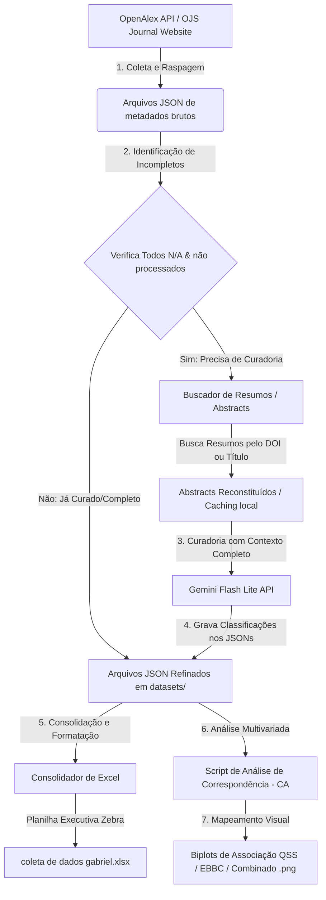

# 2 Metodologia

Este capítulo descreve os procedimentos metodológicos adotados para o desenvolvimento da pesquisa, englobando a delimitação do corpus do estudo, os métodos computadorizados de coleta de dados, a arquitetura de curadoria semântica e classificação baseada em inteligência artificial (IA) e as técnicas de análise estatística multivariada empregadas para o mapeamento intelectual da área. 

A abordagem adotada classifica-se como quanti-qualitativa de caráter empírico-analítico, utilizando técnicas avançadas de cientometria e extração de metadados para investigar a associação entre as fontes de dados bibliográficas e as ferramentas metodológicas aplicadas na literatura de estudos métricos da informação nacional e internacional.

O fluxo de execução lógico do pipeline metodológico é representado na figura abaixo:

---

## 2.1 Delimitação do Corpus do Estudo (Universo de Pesquisa)

O corpus de análise deste trabalho é constituído por artigos de duas importantes esferas de publicação da área de cientometria e estudos métricos da informação:

1. **Quantitative Science Studies (QSS)**: Periódico oficial da *International Society for Scientometrics and Informetrics* (ISSI). Foram incluídos todos os artigos publicados nos **Volumes de 1 a 6 (abrangendo os anos de 2020 a 2025)**, representando a produção científica global de fronteira.
2. **Encontro Brasileiro de Bibliometria e Cientometria (EBBC)**: Principal fórum brasileiro de discussões científicas em estudos métricos. Foram integrados os artigos publicados nas atas das edições de **2020 (7º EBBC), 2022 (8º EBBC) e 2024 (9º EBBC)**, representando o panorama intelectual e a infraestrutura de pesquisa nacional.

---

## 2.2 Procedimentos de Coleta de Dados e Extração de Metadados

Devido às diferenças nas arquiteturas tecnológicas de indexação de cada fonte, foram desenvolvidos scripts específicos em linguagem Python para realizar a extração dos metadados brutos dos artigos:

### 2.2.1 Coleta de Dados do QSS (OpenAlex API)
A coleta dos artigos da revista *QSS* foi estruturada com base na API pública do indexador aberto **OpenAlex**. O script executou requisições HTTP paginadas de forma automatizada filtrando pelo código identificador internacional da revista (ISSN: `2641-3337`) e pelos volumes específicos.
Para cada registro retornado pela API, extraiu-se:
* Identificador único (DOI);
* Título original do artigo;
* Autoria completa;
* Palavras-chave associadas;
* Resumo (*abstract*): obtido a partir da reconstrução do índice invertido fornecido pelo OpenAlex (`abstract_inverted_index`). A estrutura de dicionário mapeia cada palavra às suas respectivas posições indexadas no texto original, sendo reagrupada no script Python para gerar a cadeia de texto linear legível do resumo.

### 2.2.2 Coleta de Dados do EBBC (Web Scraping de Portais OJS)
Como a totalidade das atas das edições do *EBBC* é mantida de forma descentralizada na plataforma *Open Journal Systems* (OJS), utilizou-se técnica de mineração Web (*web scraping*).
1. O robô em Python acessou as páginas sumárias das edições (2020, 2022 e 2024) do portal `ebbc.inf.br` e isolou as URLs individuais de visualização de cada artigo utilizando expressões regulares.
2. Posteriormente, o script percorreu cada uma das páginas dos artigos e, utilizando um parser baseado na classe `HTMLParser` do Python, coletou os metadados embutidos nas tags `<meta>` do cabeçalho HTML da página (ex.: `citation_title`, `citation_author`, `citation_doi`, `citation_keywords`, `DC.Description` e `description`).

---

## 2.3 Curadoria Semântica de Conteúdo com Inteligência Artificial

Uma das principais lacunas em revisões bibliométricas manuais ou baseadas estritamente em filtros de palavras-chave (regex) é a incapacidade de interpretar o contexto linguístico. Um artigo pode conter o termo "Python" ou "R" simplesmente ao citar a ferramenta em trabalhos correlatos, sem que de fato os autores a tenham implementado metodologicamente.

Para mitigar esse viés e obter uma classificação de alta precisão científica, desenvolveu-se um pipeline de curadoria assistido por Inteligência Artificial integrado à API do modelo de linguagem **Google Gemini Flash Lite (`gemini-flash-lite-latest`)**.

### 2.3.1 Arquitetura do Prompt e Categorias Analisadas
O modelo de linguagem recebeu o resumo, título e palavras-chave de cada artigo e foi instruído a executar uma classificação semântica baseada nas seguintes variáveis:
1. **Ferramenta Utilizada**: Extração do software, linguagem de programação ou pacote estatístico efetivamente aplicado no desenvolvimento empírico (ex.: *VOSviewer, Python, R, SPSS, CiteSpace, Gephi, Excel*, etc.). Artigos teóricos ou sem uso de software foram rotulados como `N/A`.
2. **Identificação da Ferramenta**: Classificação em `Sim` (quando as ferramentas são explicitadas textualmente no título, resumo ou palavras-chave), `Não` (quando o uso de ferramentas estatísticas/computacionais é claro, mas os nomes específicos não são citados) ou `N/A` (inexistência de uso).
3. **Etapa de Aplicação (Onde Usou)**: Mapeamento funcional categorizado em:
   * *coleta dos dados* (extração, consulta a bases de dados);
   * *análise dos dados* (cálculos estatísticos, modelagem, mineração);
   * *visualização - gerar gráficos* (mapeamento de redes, gráficos).
4. **Fonte de Coleta de Dados**: Identificação das infraestruturas informacionais de onde os dados empíricos foram extraídos (ex.: *Web of Science, Scopus, OpenAlex, Dimensions, PubMed, Google Scholar, Plataforma Lattes, Brapci, Plataforma Sucupira*, entre outras).

### 2.3.2 Mecanismos de Consistência e Engenharia de Software
Para blindar o pipeline contra falhas de rede, limites de cota e variações estilísticas da IA, quatro técnicas avançadas foram programadas:
* **Saída Estruturada via JSON Schema**: A API do Gemini foi forçada a responder estritamente sob um formato estruturado (JSON com chaves restritas). Isso elimina o risco de alucinações textuais libres e possibilita a inserção automática no banco de dados.
* **Persistência Intermediária em Lotes (Batch Saving)**: O pipeline executa chamadas agrupadas a cada 10 artigos. O resultado de cada lote é gravado imediatamente em disco. Assim, interrupções externas não geram desperdício de progresso ou custos desnecessários com tokens de API.
* **Filtros Locais Híbridos (Regex)**: Uma triagem local baseada em expressões regulares é realizada antes de acionar a inteligência artificial. Casos triviais e óbvios de linguagens de programação e ferramentas padronizadas são mapeados previamente, otimizando o fluxo.
* **Cache Local de Resumos**: Todos os resumos obtidos através do OJS (EBBC) foram indexados localmente em uma base JSON de cache. Isso impede requisições consecutivas de download dos mesmos textos em novas execuções, protegendo a infraestrutura da revista.

Os resultados finais consolidados foram estruturados em uma planilha eletrônica profissional formatada (`coleta de dados gabriel.xlsx`) utilizando a biblioteca `openpyxl`.

---

## 2.4 Técnica de Análise de Dados (Análise de Correspondência - CA)

A fim de revelar as relações latentes e dinâmicas metodológicas entre as **Ferramentas de Software** e as **Fontes de Coleta de Dados**, utilizou-se a **Análise de Correspondência (CA)**, executada por meio de script estatístico Python (bibliotecas `pandas`, `numpy` e `matplotlib`).

A Análise de Correspondência é uma técnica estatística multivariada de redução de dimensionalidade adequada para variáveis categóricas em tabelas de contingência. O algoritmo mapeia a inércia dos desvios qui-quadrado das distribuições conjuntas de frequência em um espaço bidimensional de coordenadas geométricas.

### 2.4.1 Critérios de Rigor e Tratamento de Outliers
A fim de assegurar a robustez matemática e evitar distorções de escala (como o afastamento artificial dos eixos provocado por pontos de dispersão isolada), adotaram-se as seguintes regras de tratamento de dados:
1. **Filtro de Frequência Mínima ($N \ge 2$)**: Variáveis que possuíam menos de duas ocorrências no cruzamento do conjunto de dados foram filtradas. Isso remove ruídos estocásticos decorrentes de artigos de nicho.
2. **Exclusão de Tautologias Metodológicas**: Softwares acoplados nativamente à própria fonte de coleta de forma indissociável (ex.: o cruzamento exclusivo entre a ferramenta *Altmetric* e a fonte de dados *Altmetric*) foram removidos da matriz de contingência final para evitar distorção artificial da inércia explicada.
3. **Mapeamento de Coordenadas de Ajuste**: A projeção dos eixos cartesianos foi gerada a partir dos valores singulares resultantes da decomposição em valores singulares (SVD) da matriz de frequências relativas normalizada. A dispersão das categorias foi ajustada dinamicamente com o algoritmo `adjustText` para evitar sobreposição visual de rótulos nos biplots.

A aplicação desses procedimentos gerou três representações gráficas (biplots): um mapa nacional correspondente ao *EBBC*, um internacional correspondente à revista *QSS*, e um combinado agregando todo o conjunto do ecossistema de pesquisa avaliado.

---

## 2.5 Aspectos Éticos e Reprodutibilidade da Pesquisa

Esta pesquisa segue as diretrizes metodológicas do movimento da **Ciência Aberta (Open Science)**. Como o estudo analisa metadados de artigos acadêmicos já publicados e não envolve experimentos diretos com seres humanos, não há necessidade de avaliação por Comitê de Ética em Pesquisa (CEP/CONEP).

Para garantir a polidez algorítmica e a conduta ética no desenvolvimento computacional, adotou-se:
1. **Polidez de Acesso (Fair Use)**: Intervalos de atraso temporal deliberados (*delay* de 0,2s a 0,5s) foram configurados nos robôs coletores de dados para evitar qualquer tipo de sobrecarga ou negação de serviço (DoS) aos servidores das instituições acadêmicas nacionais.
2. **Reprodutibilidade Integral**: Todos os códigos-fontes desenvolvidos (scripts de raspagem, curadoria IA e cálculo estatístico da CA) juntamente com os datasets anonimizados das publicações foram publicados e disponibilizados sob a licença de código aberto MIT no repositório público do GitHub e arquivados na plataforma **Zenodo** sob o **DOI: 10.5281/zenodo.20638523**, permitindo a verificação, auditoria e replicação irrestrita por outros pesquisadores.
